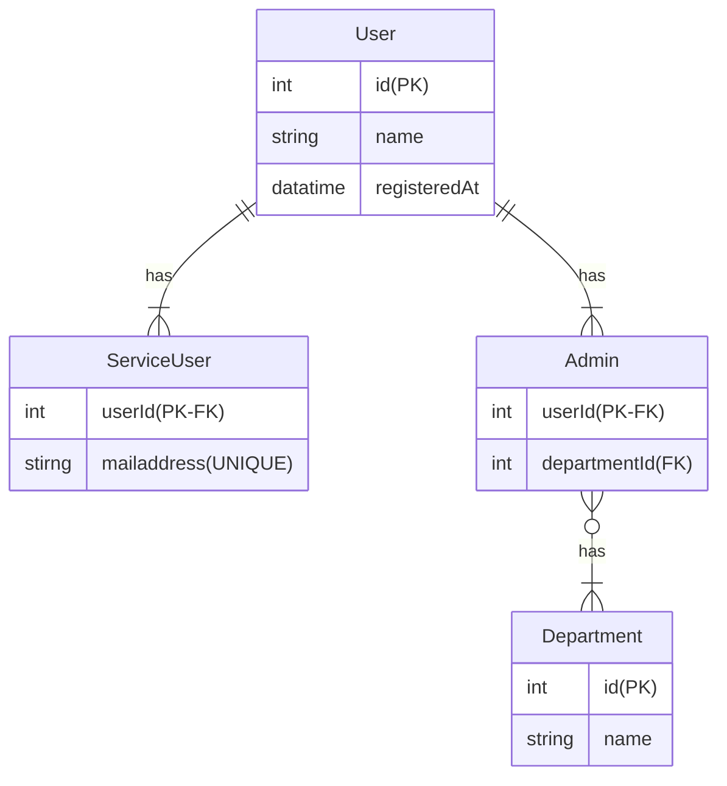

# Entity Attribute Value

サービスのユーザーを管理するテーブルです。
ユーザーは利用者と管理者の2種類存在し、それぞれ持つプロパティが異なります。

このテーブルの問題点および改善例を回答してください。

## 問題点

- type の値の取りうる範囲が決定されていない
  - 「利用者」「管理者」以外の値が入力される可能性がある
- ユーザーの属性が重複する可能性がある
  - 例えば、`mailaddress` を2個登録してしまう
- ユニーク制約をかけることができない
  - `mailaddress` の重複排除ができない

## 改善例



## SQL課題

```sql
SELECT
    users.id,
    CASE
        WHEN service_users.user_id IS NOT NULL THEN '利用者'
        WHEN admins.user_id  IS NOT NULL THEN '管理者'
    ELSE ''
    END AS `type`,
    users.name
FROM users
    LEFT OUTER JOIN service_users ON users.id = service_users.user_id
    LEFT OUTER JOIN admins ON users.id = admins.user_id
;
```
