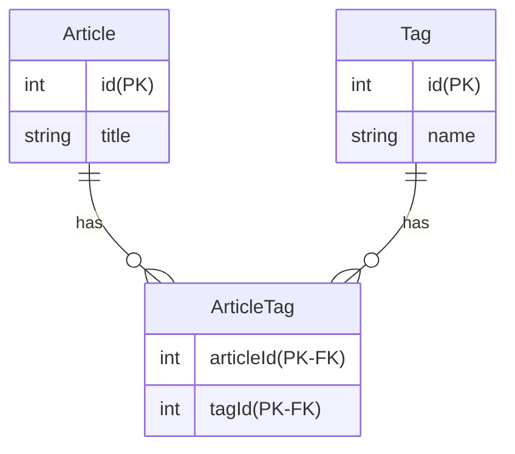

# Multi Column Attributes

記事の投稿を管理するテーブルです。
投稿にはタグを複数付与出来る機能があります。

このテーブルの問題点および改善例を回答してください。

## 問題点
提示されたテーブルで運用する事で、将来的に起きるであろう問題について箇条書きで記載してください。

- tag が2個以下のの記事の場合、tag1, tag2, tag3 が null になる
  - アプリケーション側で null 参照して、実行時エラーになる可能性がある
- tag を4個以上増やしたいときに、追加の DB マイグレーションが必要になる
  - DB マイグレーションは危険
    - マイグレーション中はロックがかかったりして、アプリケーションが停止する
    - マイグレーションは時間がかかったりする
    - マイグレーションはデータを損失する可能性がある

## 改善例

- タグは複数の記事に使いまわし可能とする



## SQL課題

```sql
SELECT articles.id, GROUP_CONCAT(tags.name SEPARATOR ', ') AS tags
FROM articles
    INNER JOIN article_tags ON articles.id = article_tags.article_id
    INNER JOIN tags ON article_tags.tag_id = tags.id
GROUP BY articles.id
;
```
