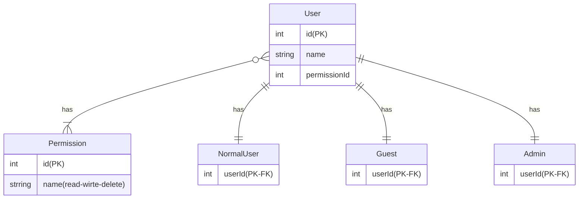

# Multi Column Attributes

サービスのユーザーを管理するテーブルです。
各ユーザーの権限は下記のとおりです。

- 通常ユーザー (is_guest: false, is_admin: false)
    - 閲覧/書き込み
- ゲストユーザー (is_guest: true, is_admin: false)
    - 閲覧
- 管理ユーザー (is_guest: false, is_admin: true)
    - 閲覧/書き込み/削除

このテーブルの問題点および改善例を回答してください。

## 問題点

- 「ゲストではないが、管理者」のデータが存在する可能性がある
- 「管理ユーザーはゲストであってはならない」のような制約があった場合、DB レベルで表現することができていない
  - 「管理ユーザー」なら `is_guest` は不要なはず
  - 同様のことを「通常ユーザー」「ゲストユーザー」の `is_admin` にも言うことができる

## 改善例



## SQL課題

```sql
SELECT users.id, users.name
FROM users 
    INNER JOIN permissions ON users.permission_id = permissions.id
WHERE permissions.name = '書き込み' -- 本来は id 指定
;
```
